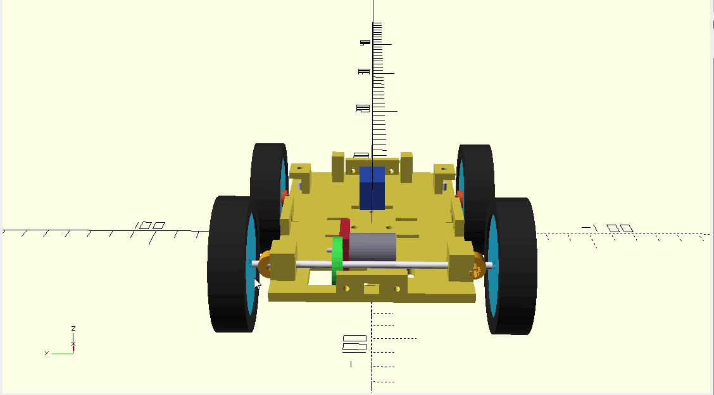
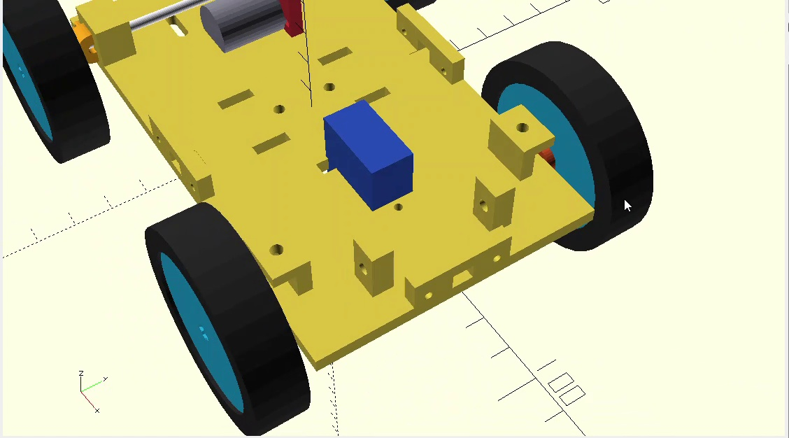
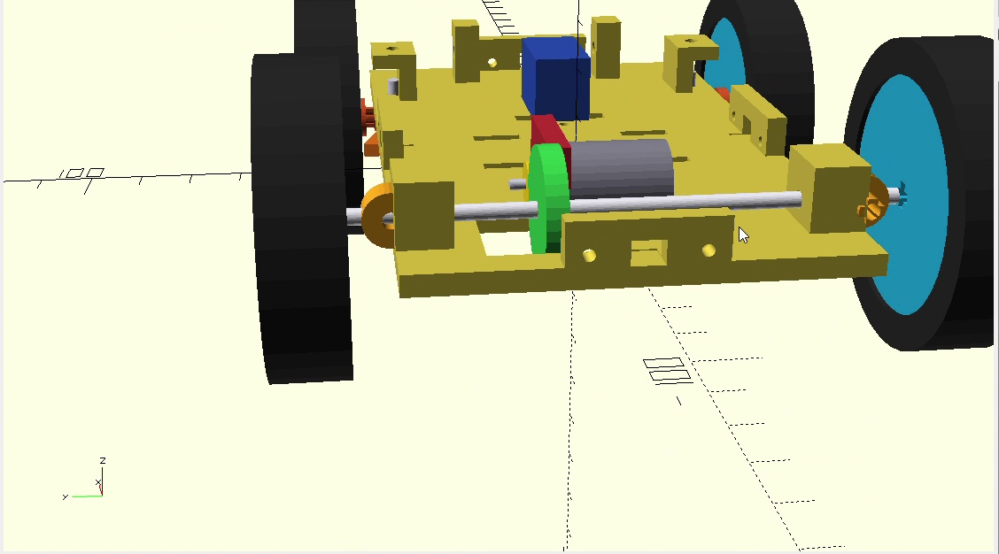
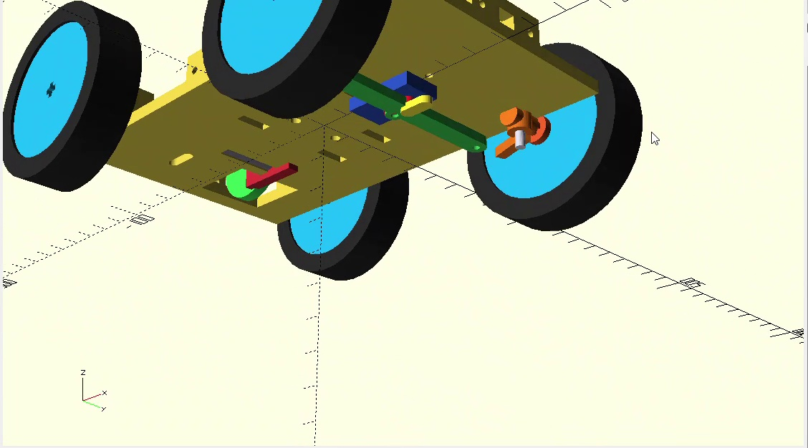
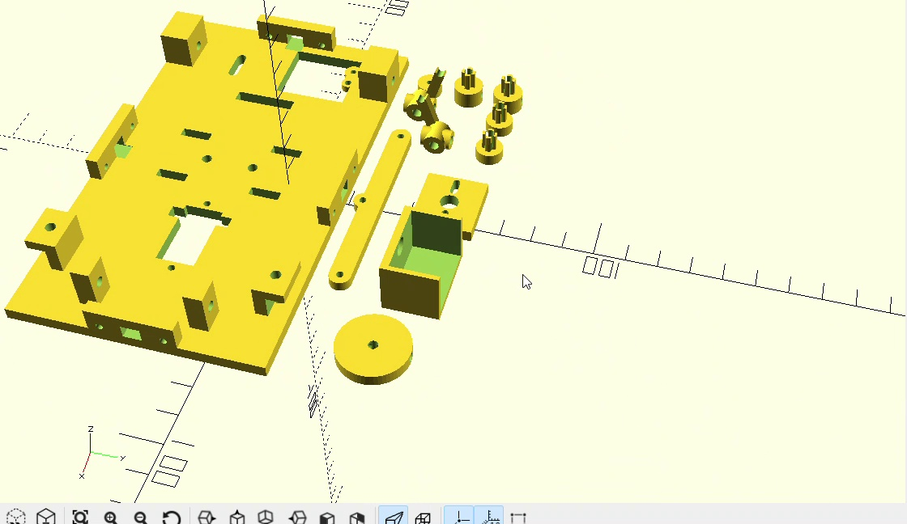
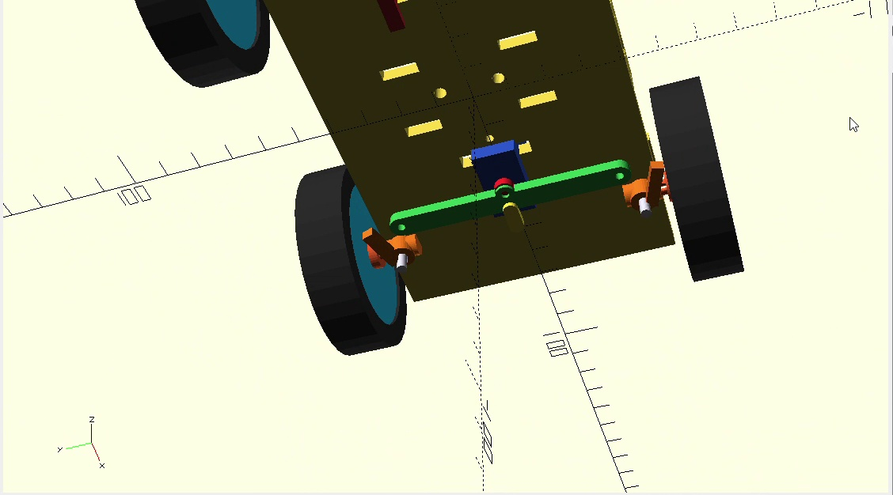

# Current Design V2

After building our first prototype, we decided to develop a new chassis design.

For V2, we focused on making the car more compact and making the mechanical parts easier to assemble and replace.

The new design includes:
- Front-wheel steering using an MG90S servo
- Rear-wheel drive using one DC geared motor
- A common rear axle connected to both rear wheels
- A replaceable motor adapter
- A removable HuskyLens camera mount
- Mounting positions for the distance sensors and electronics
- Separate printable mechanical parts for easier testing and replacement

We are now preparing this version for 3D printing and physical testing.

The next step is to assemble the car and test the steering, drivetrain, wheel clearance, and sensor positions. We will document the results and any changes we make after testing.
## CAD Design Views

### Complete Car
This view shows our current V2 mechanical design and the overall layout of the car.

### Front Steering
This view shows the front steering mechanism and the linkage used to turn the front wheels.

### Rear Drivetrain
This view shows the rear drive system, including the motor position and the common rear axle.

### Bottom View
This view helped us check the mechanical layout and the available space under the chassis.

### Exploded View
We used the exploded view to check how the separate mechanical parts fit together before printing and assembly.

### Mechanical Parts
This view shows some of the separate mechanical parts that can be printed and replaced individually.

